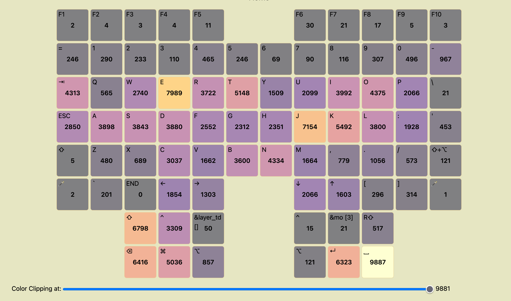

# glover

- Record keypresses from Glove80 (or potentially other ZMK-based keyboards)
- Make a heatmap for my lovely Glove80, viewable through a web interface
- Show which key combinations are used the most
- Show key "neighbors" - keys that are pressed in consequence: before or after the specific key, but not necessarily in one combination
- Merge keypress data from multiple computers

## Keyboard setup

In order for keyboard to report events, you need to put special value in config.
Refer to [ZMK docs](https://zmk.dev/docs/development/usb-logging#enabling-logging-on-older-boards)
for this. For example, in my `glove80.conf`, I have this line:

```conf
CONFIG_ZMK_USB_LOGGING=y
```

I am not aware of any way to enable similar feature of key logging without
a need for usb connection, so currently there's no other option other than
putting the line above to your keyboards' config and using it via usb.

## Run

### Track

```shell
make build
./tmp/glover track -f /dev/tty.usbmodem12301 -f /dev/tty.usbmodem12401 -o keypresses.sqlite -v
```

This will also open a web interface, default location is localhost:3000

Interface looks roughly like this:


Alternatively, you can try using auto-detection of the keybard devices:

```shell
./tmp/glover track -m monitor  -o keypresses.sqlite -v
```

This will automatically monitor your `/dev/` folder and connect new devices as they appear.

### Show

In case if you don't need active key tracking, you can only run the web interface

```shell
./tmp/glover show -s keypresses.sqlite -p 8000
```

## Develop

### Live-reload

For development, it's easy to use [air](https://github.com/air-verse/air). Make sure to install npm to make changes
to the css/js related things.

```shell
make run-dev
```

### Tests

```shell
go test ./...
go test -bench -benchtime=10s ./...
```

### Lint

Make sure you have `prettier`, `tailwindcss` and `golangci-lint` installed.

```shell
brew install golangci-lint
npm install
```

```shell
make lint
```
